<!-- # 🔌 Electric Meter Inspection Submission Website (Demo)

A full-stack web application that allows staff to submit electric meter inspection results and allows admins to manage them.  
Designed for trial use with annual inspection schedules.

---

## 🔧 Tech Stack

- **Frontend**: React.js
- **Backend**: Node.js (Express)
- **Database**: MySQL (XAMPP)

---

## 👥 User Roles

### 👤 USER
- Submit electric meter inspection results
- View their own submission history

### 🛠️ ADMIN
- Review all submitted inspection data
- Search/filter by date, location, or user

---

## 🖼️ Interface Preview


### USER
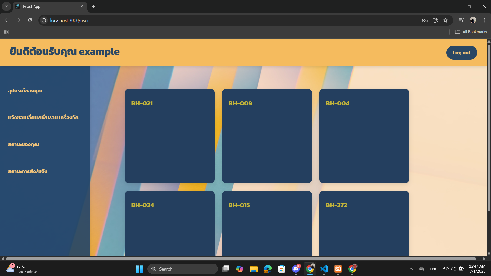
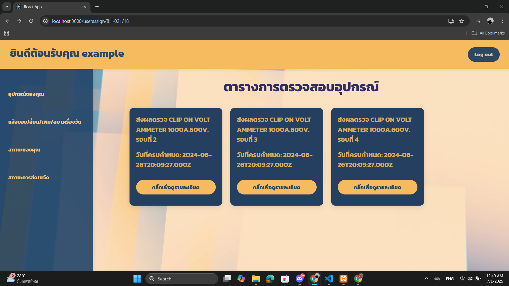
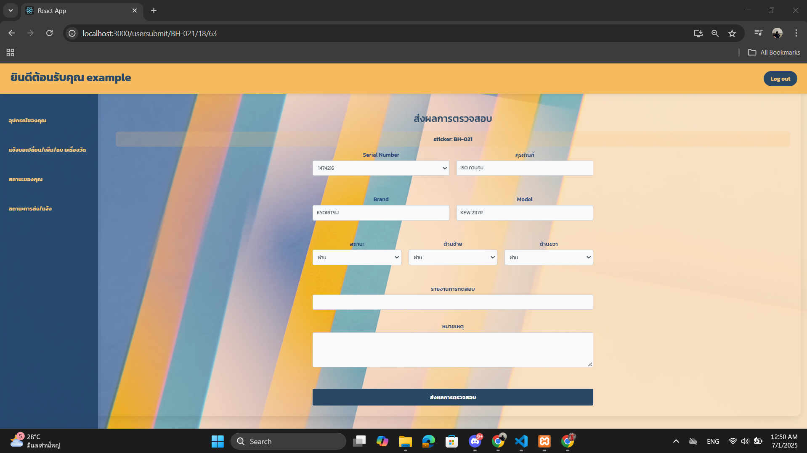
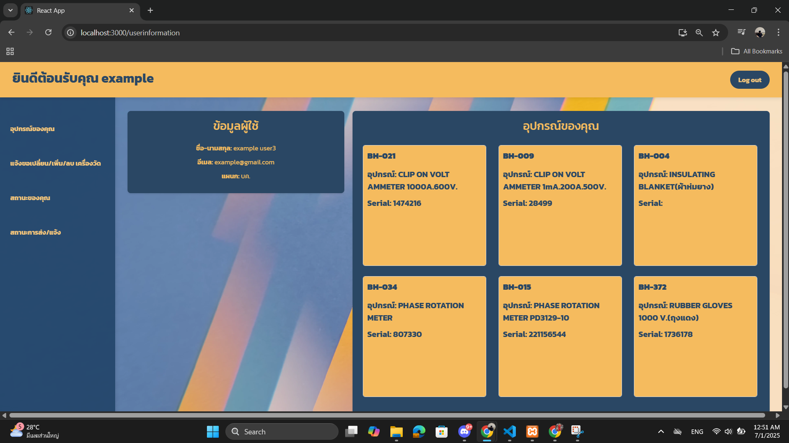
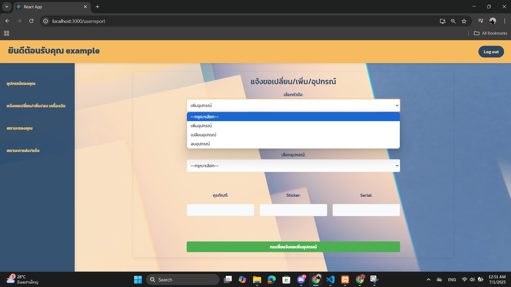
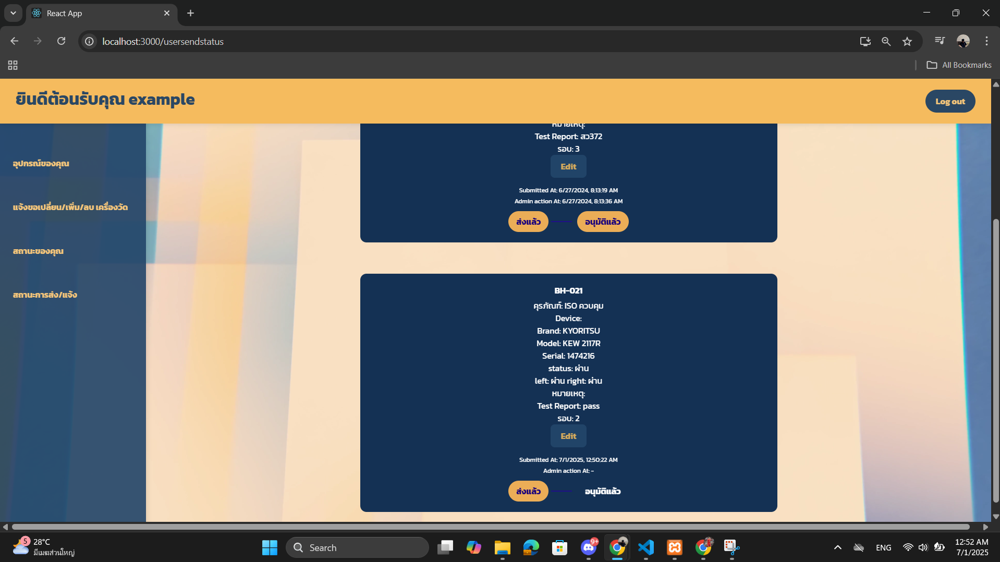

### ADMIN
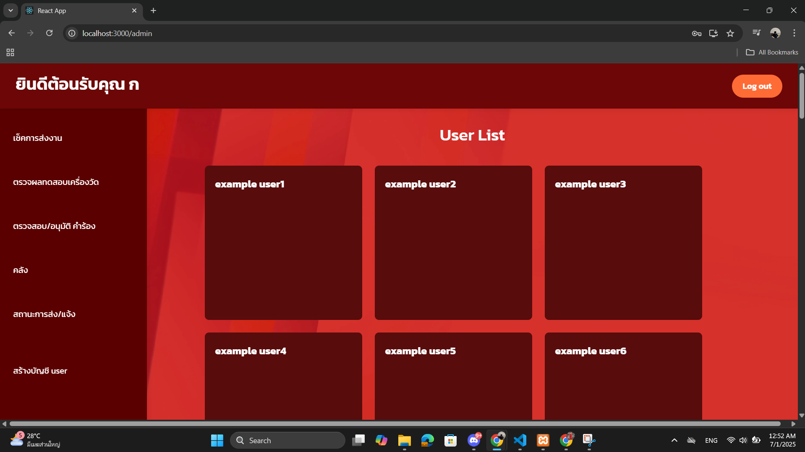
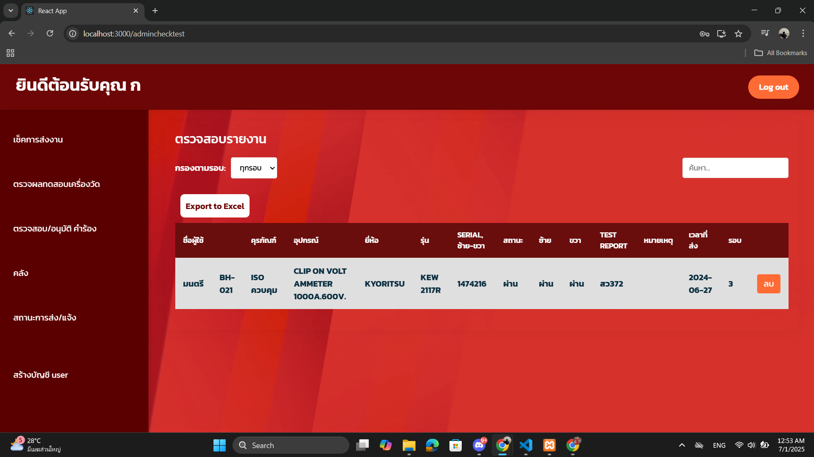
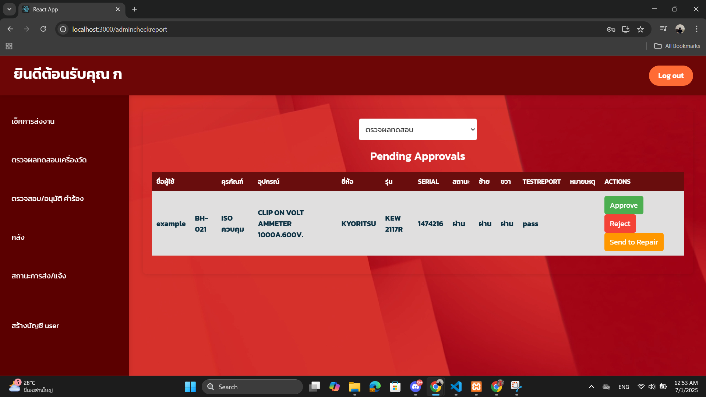
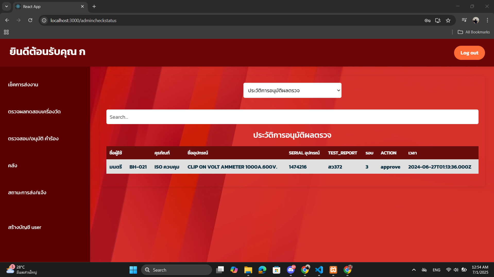
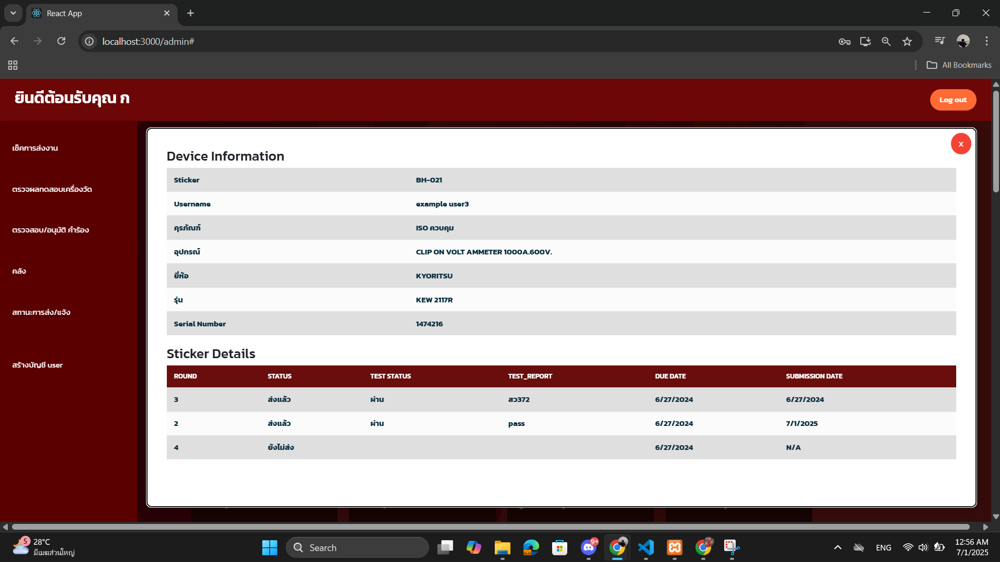

---


## 🚀 How to Run Locally

### 📁 Prerequisites

- Install [XAMPP](https://www.apachefriends.org/index.html)
- Start **Apache** and **MySQL** from XAMPP Control Panel
- Create a database (e.g., `electric_meter_db`)
- Import your SQL schema using `phpMyAdmin`

---


### Backend
```bash
cd backend
npm install
npm run dev
```


### Frontend
```bash
cd frontend
npm install
npm start
``` -->


<div align="center">

# ⚡ Electric Meter Inspection Submission Website (Demo)


**🔋 A full-stack web application that allows staff to submit electric meter inspection results and allows admins to manage them.**

*Designed for trial use with annual inspection schedules.*

</div>

---

## 🛠️ Tech Stack

<div align="center">

| **Frontend** | **Backend** | **Database** |
|:------------:|:-----------:|:------------:|
|  |  |  |
| Modern React Components | Express.js Framework | XAMPP Local Server |

</div>

---

## 👥 User Roles

<table>
<tr>
<td width="50%" align="center">

### 👤 **USER**
- 📝 Submit electric meter inspection results
- 📊 View their own submission history
- 🔍 Track inspection status

</td>
<td width="50%" align="center">

### 🛠️ **ADMIN**
- 📋 Review all submitted inspection data
- 🔍 Search/filter by date, location, or user
- 👥 Manage user accounts and permissions

</td>
</tr>
</table>

---

## 🖼️ Interface Preview

### 🌟 USER Interface

<div align="center">

<details>
<summary><b>📱 Click to view User Screenshots</b></summary>

<br>

**Dashboard & Navigation**


**Inspection Form**


**Data Entry**


**History View**


**Search & Filter**


**Mobile Responsive**


</details>

</div>

### 🛡️ ADMIN Interface

<div align="center">

<details>
<summary><b>⚙️ Click to view Admin Screenshots</b></summary>

<br>

**Admin Dashboard**


**User Management**


**Data Overview**


**Search & Analytics**


**Report Generation**


</details>

</div>

---

## 🚀 How to Run Locally

### 📋 Prerequisites

<div align="center">

| Requirement | Description | Download Link |
|-------------|-------------|---------------|
| 🔧 **XAMPP** | Local server environment | [Download XAMPP](https://www.apachefriends.org/index.html) |
| 📦 **Node.js** | JavaScript runtime | [Download Node.js](https://nodejs.org/) |
| 🗄️ **MySQL** | Database server | *Included with XAMPP* |

</div>

### 🏗️ Setup Instructions

#### 1️⃣ **Database Setup**

```bash
# 🟢 Start XAMPP Control Panel
# ✅ Start Apache server
# ✅ Start MySQL server

# 🌐 Open phpMyAdmin: http://localhost/phpmyadmin
# 🗄️ Create database: electric_meter_db
# 📁 Import your SQL schema using phpMyAdmin interface
```

#### 2️⃣ **Backend Setup**

```bash
# 📂 Navigate to backend directory
cd backend

# 📦 Install dependencies
npm install

# 🚀 Start backend server
npm run dev
```

#### 3️⃣ **Frontend Setup**

```bash
# 📂 Navigate to frontend directory  
cd frontend

# 📦 Install dependencies
npm install

# 🌐 Start React application
npm start
```

### 🎯 **Access Points**

<div align="center">

| Service | URL | Status |
|---------|-----|--------|
| 🌐 **Frontend** | `http://localhost:3000` |  |
| 🔧 **Backend API** | `http://localhost:5000` |  |  
| 🗄️ **Database** | `http://localhost/phpmyadmin` |  |

</div>

---

## 📁 Project Structure

```
electric-meter-inspection/
├── 📂 frontend/
│   ├── 📂 src/
│   ├── 📂 public/
│   ├── 📄 package.json
│   └── 📄 README.md
├── 📂 backend/
│   ├── 📂 routes/
│   ├── 📂 models/
│   ├── 📄 server.js
│   └── 📄 package.json
├── 📂 assets/
│   ├── 📂 user/
│   └── 📂 admin/
└── 📄 README.md
```

---

## 🔧 Features

### ✨ **Core Functionality**

- 📝 **Inspection Submission** - User-friendly form interface
- 📊 **Data Management** - Comprehensive admin dashboard  
- 🔍 **Search & Filter** - Advanced data filtering capabilities
- 📱 **Responsive Design** - Works on all device sizes
- 🔐 **User Authentication** - Secure login system
- 📋 **History Tracking** - Complete audit trail

### 🎯 **Trial Features**

- 📅 **Annual Schedule** - Designed for yearly inspection cycles
- 👥 **Multi-user Support** - Staff and admin role separation
- 📈 **Progress Tracking** - Monitor inspection completion
- 💾 **Data Export** - Generate reports and backups

---

<div align="center">

## 🎉 Ready to Get Started?

**Follow the setup instructions above and start managing your electric meter inspections efficiently!**


---

*⚡ Streamline your inspection process with modern web technology*

</div>